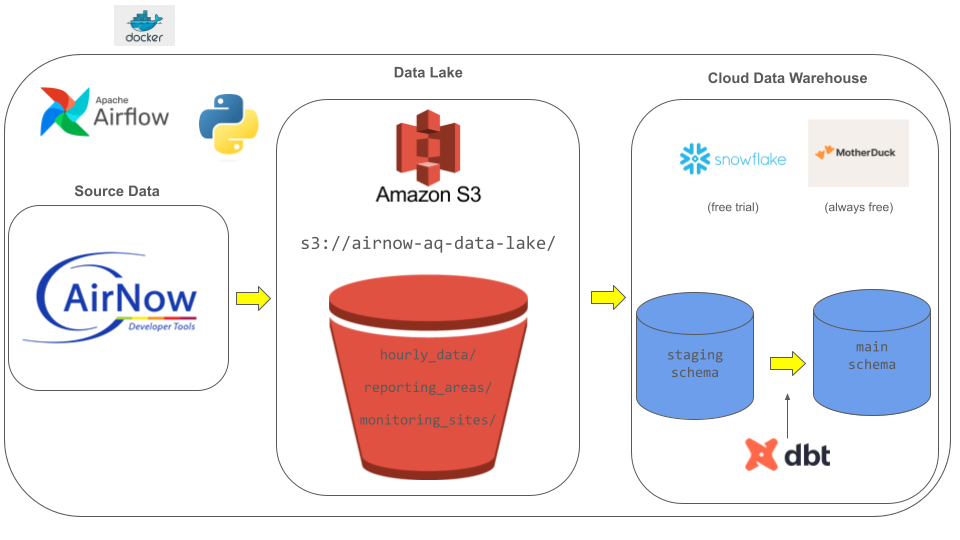
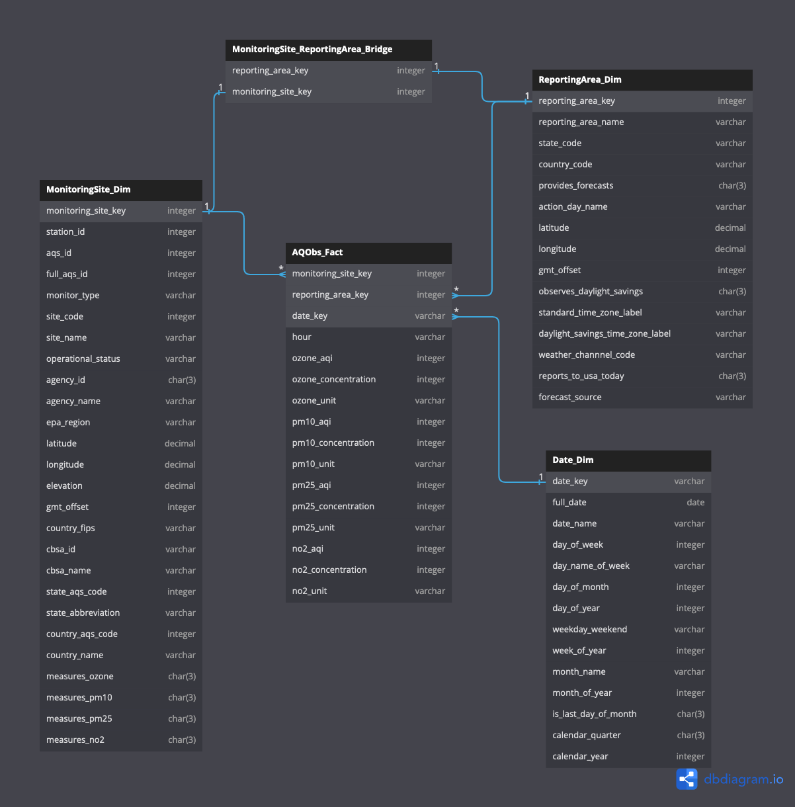

# Air Quality Data Pipeline

### Background

This project is a data pipeline designed to retrieve hourly measurements of air pollutants from the AirNow API provided by the US Environmental Protection Agency. The data warehouse model is structured to contain hourly measurements of four key air pollutants: ozone, PM 10, PM 2.5, and NO2. The structured data model facilitates historical analysis of air quality trends over time. By storing hourly measurements, users can analyze patterns, seasonal variations, and long-term trends in air pollutant concentrations. In addition to a date dimension, the data warehouse contains dimensions for monitoring sites that send data to the EPA as well as the reporting areas that the monitoring sites cover, enabling analyses of air quality by geographic location. The inclusion of latitude and longitude in these dimensions makes for some very nice visualizations or reporting applications.

Access to comprehensive air quality data empowers policymakers, researchers, and environmental advocates to make data-driven decisions. Whether it's assessing the effectiveness of pollution control measures, identifying areas of concern, or evaluating the impact of environmental policies, this data pipeline supports informed decision-making processes.

### Data Pipeline

**ETL**
The ETL pipeline begins with data ingestion from the AirNow API, followed by conversion into the Parquet format for optimized storage efficiency. The Parquet format is chosen to minimize storage costs while maintaining data integrity. The transformed data is then securely stored in an Amazon S3 bucket.

**Data Warehousing**
Once stored in Amazon S3, the data is loaded into an Amazon Redshift data warehouse, where it undergoes further transformations and modeling. Leveraging the power of Redshift, the data is structured into a cohesive data model using DBT (Data Build Tool). This step prepares the data for seamless analysis and reporting.

**Orchestration with Airflow**
Airflow serves as the backbone of the ETL pipeline, orchestrating and scheduling each step. Hosted within Docker containers, Airflow ensures reliable execution of daily data retrieval, storage, and loading processes.

Designed with scalability and automation in mind, the pipeline architecture can seamlessly handle large volumes of data over time. The idempotent nature of the pipeline ensures consistent processing, even with incremental updates. This architecture provides a robust foundation for scalable, automated, and reliable data processing.

# Data Model

**Fact Table**
The Fact_AQObs table serves as the central repository for air quality measurements related to key air pollutants including [ozone](https://www.epa.gov/ground-level-ozone-pollution), [PM10](https://www.epa.gov/pm-pollution/particulate-matter-pm-basics), [PM2.5](https://www.epa.gov/pm-pollution/particulate-matter-pm-basics), and [NO2](https://www.epa.gov/no2-pollution). Each entry in this table represents hourly measurements, making it suitable for granular temporal analysis.

**Dimensions**
- Date Dimension: Enables analysis of temporal trends by providing date-related attributes.
- Reporting Area Dimension: Facilitates the examination of geographical trends by associating air quality measurements with specific reporting areas.
- Monitoring Site Dimension: Offers insights into air quality variations at specific monitoring sites.

**Bridge Table**
In addition to the core dimensions, a bridge table links monitoring sites to their respective reporting areas. This normalization step enhances data integrity and supports more efficient data querying and analysis processes.

